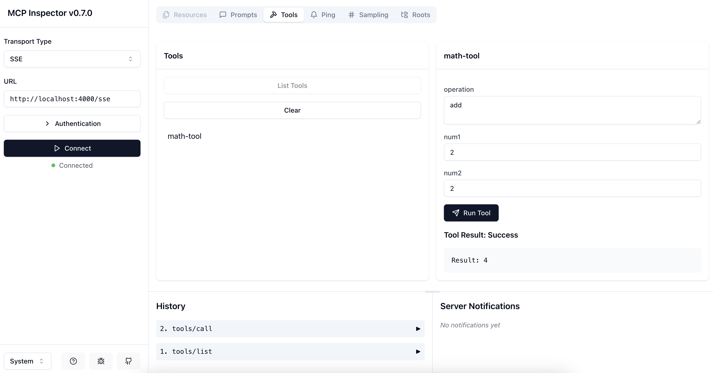
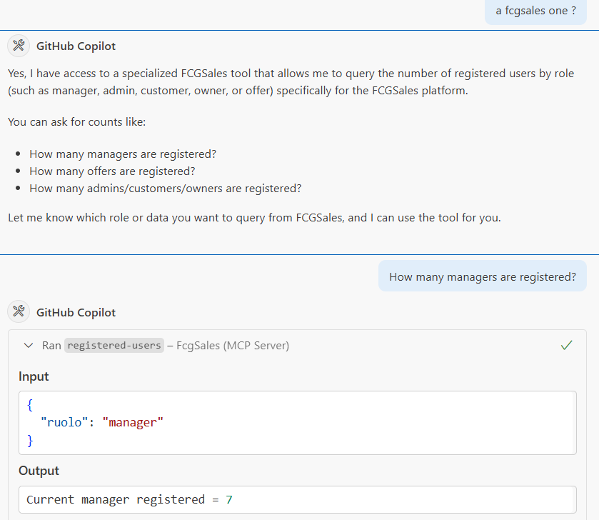
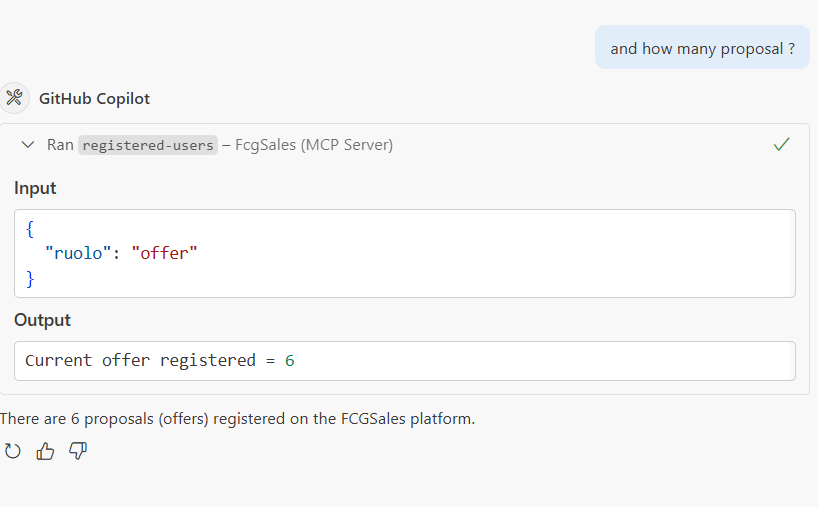

## Table of Contents
- [MCP Server POC](#mcp-server-poc)
  - [Testing the Server](#testing-the-server)
    - [1. Using the MCP Inspector](#1-using-the-mcp-inspector)
    - [Run \& Debugging](#run--debugging)
    - [Additional Server \& Client](#additional-server--client)
    - [Example usage](#example-usage)
- [Disclaimer](#disclaimer)
  - [License](#license)

# MCP Server POC

Scope of the project is to simply help users to be aware of the new MCP Protocol

## Testing the Server

### 1. Using the MCP Inspector

The MCP Inspector is a tool to test and inspect your MCP server. You can use it to verify that your tools and prompts are registered correctly.

Run the following command to inspect your server:

```bash
npx @modelcontextprotocol/inspector
```

This will open an interactive interface where you can test the tools and prompts registered in your server like below.




### Run & Debugging

Build the project

```bash
npm run build
```

Prepare the environment

```bash
npm install --save-dev ts-node
```


Use the following command to run the server:

```bash
npm run dev
```

This will start the server with live reloading and detailed logs.

### Additional Server & Client

Being caught in a vibe coding loop I developed some additional server & clients.

    "server": "ts-node src/SESServer.ts"

    "client": "ts-node src/SESClient.ts",

    "streamable": "ts-node src/StreamServer.ts"

    "streamclient": "ts-node src/StreamClient.ts"

These are the differences with the first Server 

    "dev": "ts-node src/server.ts" -> use McpServer from "@modelcontextprotocol/sdk/server/mcp.js" (high level Server)

    "server": "ts-node src/SESServer.ts" -> use Server from "@modelcontextprotocol/sdk/server/index.js" (low level Server)

    "client": "ts-node src/SESClient.ts" -> MCP Client

    "streamable": "ts-node src/StreamServer.ts" -> (low level Server con Streamable Transport)

    "streamclient": "ts-node src/StreamClient.ts" -> MCP Client con Streamable Transport


### Example usage

You can ask the LLM to use the tool and you'll be explained to you what you can do.

You can choose what you want and you'll get an answet



You can then ask in your natural language and the LLM will adapt that for you by calling the tool in the right way get an answet




# Disclaimer 

Current project has been forked from this SDK:

**Hello World MCP Server**! [Model Context Protocol (MCP)](https://github.com/modelcontextprotocol/typescript-sdk) 

This SDK has been detailed in this blog post: [Building a TypeScript MCP Server: A Guide for Integrating Existing Services](https://medium.com/@jageenshukla/building-a-typescript-mcp-server-a-guide-for-integrating-existing-services-5bde3fc13b23). 

## License

This project is licensed under the MIT License. See the [LICENSE](LICENSE) file for details.
